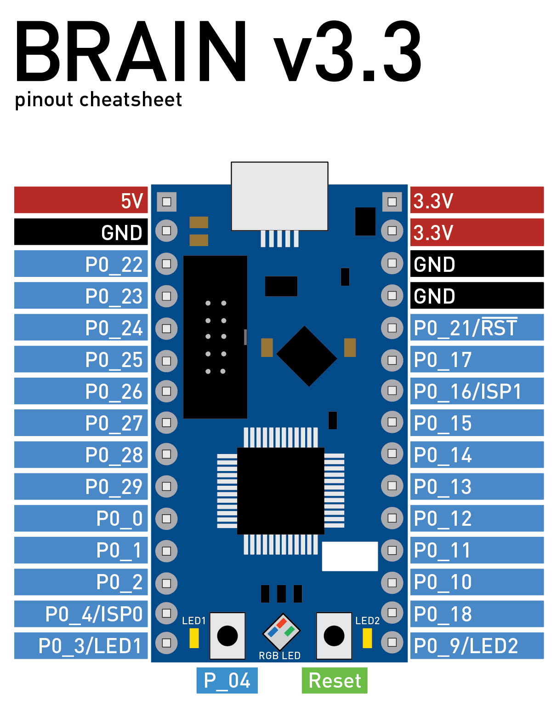

# braintrain
These are a series of introductory self-paced labs teaching beginning embedded software engineering concepts.

These use CalSol's BRAINv3, a LPC1549-based microcontroller board.

Labs currently available:
- [Lab 1: Embedded Introduction](lab1.md)
- [Lab 2: CAN Bus and Multitasking](lab2.md)

Coming soon:
- Suggest something!

## Quick Reference
Detailed instructions for setting up the build system are in [Tachyon-FW](https://github.com/CalSol/Tachyon-FW#setup).
In short, you will need to install GCC-ARM, SCons, and OpenOCD, all of which are available for Windows, Linux, and Mac.

To sanity-check the build and flashing system, run:
```
scons flash-braintest
```
to flash stock code that cycles the hue of the RGB LED and toggles the two side LEDs.
Pressing the user button should pause the hue and LED toggling.
See [Lab 1](lab1.md) for more details.

To build and flash your code (in `src/main.cpp`), run:
```
scons flash-brain
```

