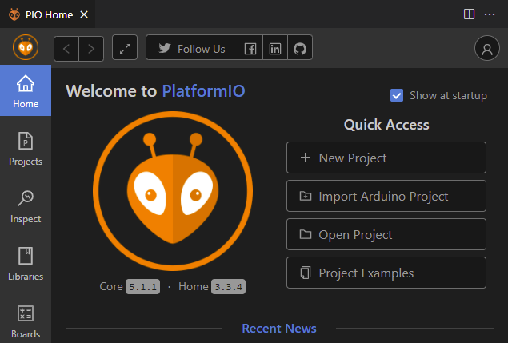
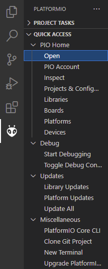
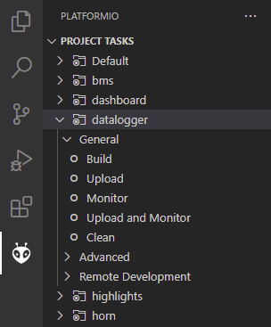
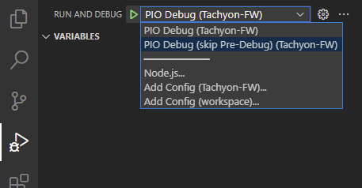
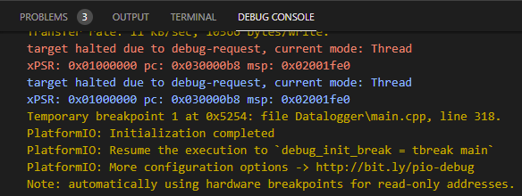

# Setup

## PlatformIO Setup and Getting Started
_PlatformIO is a cross-platform (in every sense of the term: multiple OSes, multiple frameworks, mulitple chips across multiple vendors) build tool that handles the details of setup for you._

### PlatformIO with VSCode
**Note**: _PlatformIO extensions are also available for [other IDEs](https://platformio.org/install/integration) such as Eclipse, if you're more familiar with them._
_VSCode is our baseline supported IDE since it's a free and open-source*, cross-platform (Windows / Mac / Linux), and full-functioned C/C++ IDE that works pretty well._

> <details>
>   <summary>* VSCode and open-source</summary>
>
>   While VSCode is open-source, the VSCode binaries from Microsoft have a proprietary license and are not direct builds of the open-source repositories.
>   See <a href="https://vscodium.com/">VSCodium</a> for more details, if this matters to you.
>
>   As PlatformIO is currently not available on the VSCodium package manager, you will need to <a href="https://marketplace.visualstudio.com/items?itemName=platformio.platformio-ide">download the .vsix</a> and install it.
>   It may also depend on C/C++ support for VSCode, and you'll have to <a href="https://github.com/microsoft/vscode-cpptools/releases">download the .vsix</a> and install it.
> </details>

Follow the [official instructions](https://docs.platformio.org/en/latest/integration/ide/vscode.html#installation).

**Installation tl;dr preview for most users**: [install VSCode](https://code.visualstudio.com/) (if you don't have it already), and install the PlatformIO extension from the package manager.

**Getting Started with VSCode**: Once VSCode is installed, follow these steps to get started.

1.  Open the project, by clicking "Open Project" from the PIO Home page, then navigate to where you cloned this repo (platformio.ini should be in this folder).

    

    - If this isn't visible, you may need to select the PlatformIO tab on the far left, then navigate to PIO Home > Open.

      

1.  If the project loaded correctly, you should be able to see the list of targets on the PlatformIO tab on the left side:
    
    
    
1.  Expand one of those targets (such as datalogger shown above) to see the available options.

1.  Click "Build" to compile firmware for that target, without uploading to the board.
    > Common operations are also available on the bottom toolbar.
    >
    > 
    >
    > For example, the check mark also performs a build.
    
1.  To upload and run in debug mode, navigate to the Debug tab on the left side:

    
    
    From the dropdown, select the "skip Pre-Debug" configuration (as indicated in the picture).
    > The normal (non skip Pre-Debug) configuration unnecessarily compiles the firmware twice and takes more time to launch.
    > You only need to set this once, and this configuration applies for all debug launches.
    
    Then, click the green arrow to start debugging.
    > You can also start debugging by going to main menu > Run > Start Debugging.
    > The menu item should also show the associated hotkey.
    >
    > Although there is also an Upload option, that seems broken and its usage is not recommended.
    
    You may need to switch to the Debug Console to see the compile and upload progress:
    
    
1.  When upload completes (and debugging starts), it will breakpoint (pause the microcontroller) by default right before entering `main`.
    From the debug controls toolbar , you can resume, pause, and single-step through code.
    Mouse-over the buttons for descriptions and hotkeys.
    > Step-over runs the current line of code (even if it's a function call), then pauses at the beginning of the next line.
    > Step-into steps into the function at the current line of code, pausing at the beginning of the first line in that function.
    > The microcontroller can be paused at any point while the microcontroller is running.
    >
    > Pausing in debug does NOT pause the watchdog timer (if the code uses it).
    > The microcontroller may unexpectedly reset in this case.
    
1.  You can also open the serial monitor, from the PlatformIO tab on the left side.
    This opens a terminal that shows the serial output from the microcontroller.

### PlatformIO Core (command-line)
Follow the [official instructions](https://docs.platformio.org/en/latest/core/installation.html).

**tl;dr for most users**: download a Python installer script and run it.

Once you have PlatformIO installed (and `pio` working on the command-line), you can run PlatformIO commands while in the repository folder.
To build _all_ binaries, run:
```
pio run
```

To build a specific board, such as `datalogger`, run:
```
pio run -e datalogger
```
See the `[env:...]` sections at the end of [platformio.ini](platformio.ini) for available targets.

To upload binaries, run (with the target board connected to your computer via a programming dongle):
```
pio run -e datalogger --target upload
```

> <details>
>   <summary>Avoiding conflicts with VSCode</summary>
>
>   If you also have VSCode with PlatformIO installed and want to be able to use both: you can configure VSCode to use the system version of PlatformIO (as opposed to its own copy) to avoid conflicts.
>   In VSCode > main menu > File > Preferences > Settings, go to Extensions > PlatformIO IDE configuration, then uncheck "Use Builtin PIOCore" (and optionally uncheck "Use Builtin Python").
> </details>


## Repository Checkout

**If you already know git:**
You can skip this section and check out the repo.

### GitHub Desktop
_GitHub Desktop provides a graphical user interface (GUI) for basic and common git operations, like pull, commit, and creating and switching branches._
_Submodules are handled automatically for you._
_Windows and Mac only._

**GitHub Desktop is recommended if you prefer or are more familiar with graphical user interfaces, rather than command-line tools.**
**The basic operations supported by GitHub Desktop are sufficient for almost all routine CalSol development.**

1. Download and install [GitHub Desktop](https://desktop.github.com/).
1. Clone this repository to desktop using the "Clone or download" button on the web interface. It should automatically launch GitHub Desktop.
1. In the GitHub Desktop interface, you can sync the repository (push new changes to GitHub if you have the appropriate permissions, as well as pull updates from GitHub) using the "Sync" button.

### Command-line git
_Command-line git is as powerful as git gets, but has a steeper learning curve._
_If you intend to do software development professionally, you may eventually or occasionally need the more advanced operations provided by command-line git, even if they may not be useful for CalSol._

1.  Install Git:
    - For Windows:
      [Download and install git](https://git-scm.com/download/win), checking the "Use Git from the Windows Command Prompt" at the end of the install if you want to run git from outside Git Bash - such as from the Windows Command Prompt or PowerShell.
    - For Mac:
      Download and install homebrew, then
      ```bash
      brew install git
      ```
    - For Linux:
      ```bash
      sudo apt-get install git
      ```
1.  Clone (download a copy of) the repository:

    ```
    git clone --recursive https://github.com/CalSol/braintrain.git
    ```
