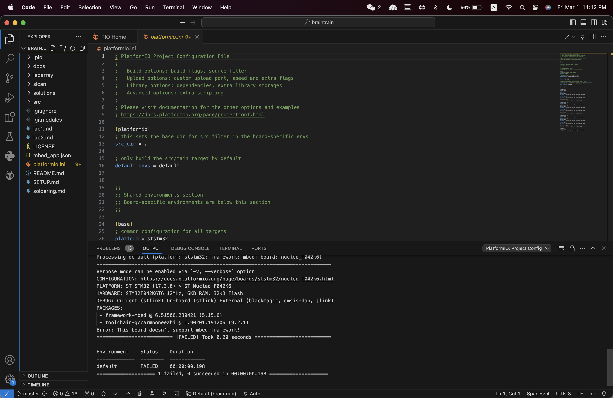
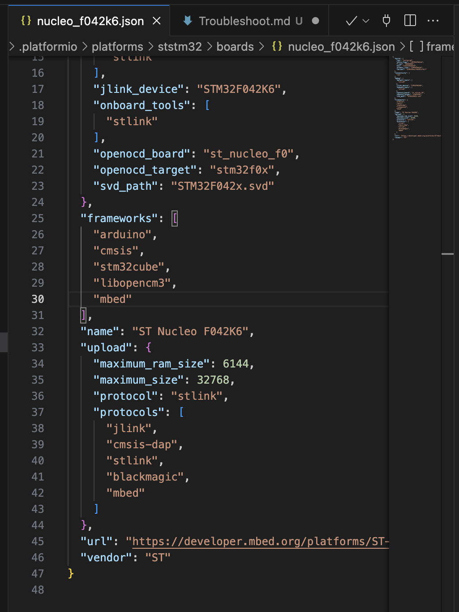

# Troubleshooting

## Nucleo Does not support mbed framework

__The fix is to navigate to `
/Users/[Username]/.platformio/platforms/ststm32/boards/nucleo_f042k6.json `
And open it up in a text editor. VS Code works fine. Then, after line 29, add a comma `,`. Create a new line after line 29 and add `"mbed"` to the list. Example shown below.__

## Ipsum Lorem
Ipsum Lorem

## Ipsum Lorem
Ipsum Lorem