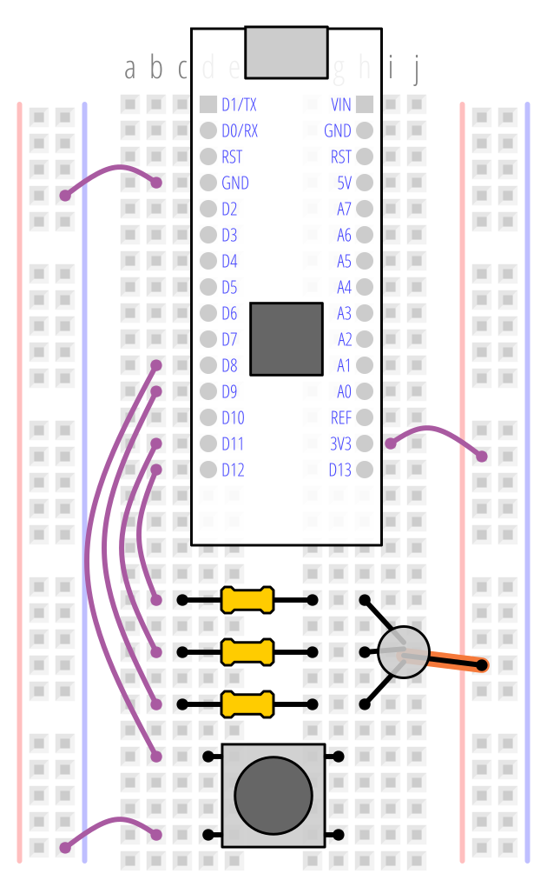

# lab1: Embedded Introduction

## Objectives
Target audience
- Anyone with no practical experience with Arduino-level embedded systems or with the mbed API.
  - All electrical team members, whether focusing on software or hardware, should attend.
  - Anyone in general (even the mech people!) that is interested is also welcome to attend.

Assumptions:
- You have gone through the installation lab.
- You know are familiar with imperative programming languages (like C) and object-oriented style (like C++ / Java), and can at least stumble through C++ syntax.
- You can read electronics schematics.

Objectives
- Play with inputs (button) and outputs (LEDs) controlled by software running on an embedded microcontroller.

## Introduction
In the context of CalSol, an embedded system refers to a microcontroller-based system, which runs code (firmware) that interacts with (through inputs such as sensors or buttons, and outputs such as actuators or LEDs) the physical world.

A microcontroller is a full computer system on a chip, including a CPU, flash, RAM, and IO. You'll be working with the [NUCLEO-F042K6](https://os.mbed.com/platforms/ST-Nucleo-F042K6/) containing an STM32F042K6 that has a (up to) 48 MHz Cortex-M0 processor, 32 KiB of flash memory, 6 KiB of RAM, and various IO.

We've also standardized on using the [PlatformIO](https://platformio.org) IDE and [Mbed](https://os.mbed.com) framework to provide a streamlined development process and nicer API to control the underlying hardware.

This lab will walk through some simple examples to get started. If doing this lab during one of the scheduled training sessions, consider pairing up.

## Hardware Setup

Before we get to coding, we need to setup the NUCLEO-F042K6 on a breadboard and connect an RGB LED and button to it. Breadboards are internally connected like in the following picture.


Here's the pinout for the Nucleo.


Ultimately, we want our circuit to match the following schematic.


To make things easier, here's a diagram of how your breadboard could be hooked up (there's an infinite number of ways this is just one). The orange leg (common anode) of the RGB LED is the longest leg.



## Sanity Check
If you want to sanity-check your hardware and build environment, you can build and flash test code with this command (run this outside the `src` folder, **inside** the `braintrain` folder, while you have the programmer and board connected).
```
pio run -e sanity -t upload
```

While most of this lab refers to CLI commands to work with PlatformIO, you can always just use PlatformIO's GUI instead.

This should fade the RGB LED through all the colors over a period of 3 seconds. If you press the button at anytime, it should pause this fading until the button is released.

## Lab 1.1: Getting started

1. If you haven't already done so, set up [the build system](SETUP.md).
1. Clone this repository.

## Lab 1.2: "Hello, World!"
While the typical programming "Hello, World!" is to print text on a screen, we don't have a screen on our BRAINs. Instead, we will do the typical embedded "Hello, World!": the blinking LED.

Start by taking a look at [src/main.cpp](src/main.cpp). At the top, you will see Mbed object declarations that assign certain functionality (like `DigitalOut`) to pins (like `D10`):

```c++
#include "mbed.h"

DigitalOut led1(LED1);

RawSerial serial(SERIAL_TX, SERIAL_RX, 115200);

// Replace pin assignments if different
PwmOut ledR(D9);
PwmOut ledG(D11);
PwmOut ledB(D12);

DigitalIn btn(D8, PullUp);
```

**Objective**: Flash the on-board LED (led1) at 1 Hz. That is, turn it on and off once per second.

> LEDs are electronic devices that emit light when current flows through them from anode (A) to cathode (K).
>
> The circuit on the NUCLEO-F303K8 for on-board LED is:
>
> 
>
> The LED turns on (emits light) when the pin voltage is high.

Mbed's [DigitalOut](https://os.mbed.com/docs/mbed-os/latest/apis/digitalout.html) provides a way to control an IO pin as a digital output - the pin can be set low (0v in this case) or high (3.3v in this case). Note that from the [example and API docs](https://os.mbed.com/docs/mbed-os/latest/apis/digitalout.html), this can be done by assigning 0 or 1 to the object. For example,

```c++
led1 = 1; //or
led1.write(1);
```

will turn on the left LED, while

```c++
led1 = 0; //or
led1.write(0);
```

will turn off the left LED.


Feel free to try playing with the LEDs by writing some code and deploying it.

> In C and C++, programs start inside the `main()` function. We've given you a empty `main()` function here:
>
> ```c++
> int main() {
>   /* YOUR INITIALIZATION HERE */
>
>   while (true) {
>     /* YOUR CODE HERE */
>   }
> }
> ```
>
> This has been structured as typical embedded code: an (optional) initialization section, followed by code repeating forever in a main loop. This is normal because we want the code to run forever as long as there is power. Usually it is not that useful if the code runs once on boot and not again until it is reset or the power is cycled.

Mbed also has basic timing functions, like [wait](https://os.mbed.com/docs/mbed-os/latest/apis/wait.html), that waits for (approximately) some specified number of seconds regardless of the underlying hardware characteristics (like processor speed). For example,

```c++
wait(0.1)
```

will delay by 100ms. This may be useful for getting the (approximate) 1Hz blink rate.

Done? Build and flash firmware by running:
```
pio run -t upload
```
outside the `src` folder (inside the `braintrain` folder) or doing the equivalent from inside VSCode.

You can also compare against [the solution here](solutions/lab1.2.cpp).

## Lab 1.3: Now with _inputs_!
A system that only produces outputs isn't much fun. Let's do something with the button.

**Objective**: Pause the blinking as long as the button is pressed.

Like DigitalOut, mbed also has a [DigitalIn](https://os.mbed.com/docs/mbed-os/latest/apis/digitalin.html) that allows it to read the logic level on a pin, also as either low (0v to some threshold, in this case) or high (some threshold to 3.3v, in this case). Since `DigitalIn` provides an implicit cast to an `int`, it can be used anywhere that expects an `int` such as a conditional:

```c++
if (!btn) {
  /* do something if button is pressed */
}
```

> Switches are electronic devices that connect (or disconnect, in some cases) a circuit when pressed.
>
> The circuit for the button we connected is similar to this:
>
> 
>
> Commonly, user buttons are designed like this: a resistor pulls up the pin high when the switch is not pressed, and the switch shorts the pin low when the button is pressed. This also explains the inversion (`!btn`) in the example above to detect a pressed (low) state. In our case, the Nucleo has a software configurable pull-up resistor builtin so we don't need to connect one ourselves externally.

Done? Compare against [one possible solution here](solutions/lab1.3.cpp).

You may realize that while the high-level objective (pause blinking) might appear clear, there are many different implementations that could result in subtly different behaviors. For example, it's unspecified whether pressing the button only needs to stop toggling the LED (as in the example solution) or if it should pause the counter (for example, if you press the button 0.25s after the last toggle, it shouldn't toggle for 0.25s after you release the button). For a toy example and at these timescales for human reaction, it's inconsequential, but that won't be true for every system you work on...

> Switches also suffer from mechanical bounce, where during press or release, the switch may jump between connected and disconnected several times before settling down. For applications which rely on edge detection (the high to low or low to high transition on the input) and sample fast enough, this may cause it to register false edges. Two common methods to "debounce" switches are either with a RC (resistor-capacitor) circuit or with filtering software.

## Lab 1.4: "Hello, World!", but for reals
Most programmers will find a `printf` like utility to be very helpful. Let's get a terminal up and running and displaying data from your Nucleo.

**Objective**: Print versioning information (build time) on system start and then start flashing led1 at 1 Hz. Print `led1=x` (where `x` is the state of `led1`, either 0 or 1) every toggle.

Mbed's [RawSerial](https://os.mbed.com/docs/mbed-os/v5.15/apis/rawserial.html) provides access to a UART, a hardware block commonly used for sending text data to a host PC.

> [UART (universal asynchronous receiver-transmitter)](https://en.wikipedia.org/wiki/Universal_asynchronous_receiver/transmitter)  transmits a frame of data (typically a byte, or 8 bits) serially (that is, one at a time: each bit is placed on the digital line for some duration before the next bit is "shifted out"). Since there is no external clock (defining when bits transition), both the receiver and transmitter must agree on baud rate (bit rate).
>
> Here, we initialize the UART at 115200 baud, which is one of the faster but still common rates.


> RawSerial vs. Serial: mbed also offers a [Serial](https://os.mbed.com/docs/mbed-os/v5.15/apis/serial.html) interface, which provides an additional file-like abstraction. We don't need that, so we don't use it, preferring to use the more lightweight RawSerial directly.

To connect to the serial terminal on your PC:
- For Windows:
  - Open up the Device Manager and find the COM port (like COM4) for USB Serial Device.

    
  - Open up a serial terminal (like [PuTTY](http://www.chiark.greenend.org.uk/~sgtatham/putty/download.html), and connect to the COM port you found (above) at 115200 baud.

    

- For Mac:
  - To view Serial output we will use minicom. Open up a terminal window and install it with `brew install minicom`.
  - Open up a serial terminal by typing in `minicom -b 115200 -D \dev\tty.usb` and then press tab to autocomplete the device name. If you have trouble ask someone.
  - To exit minicom, press `ESC-Shift-z`, and then use the exit command `Shift-x`
  - There are other alternatives such as [SerialTools](https://apps.apple.com/us/app/serialtools/id611021963?mt=12) and `screen`.

- For Linux:
  - You're a power user, you probably already know how. There's also way too many Linux distros out there with subtly different behaviors (like serial terminal permissions!).

### Display to Serial
The simplest RawSerial operation is `puts`, which writes out the string passed into it. For example, one way to print versioning information would be:

```c++
serial.puts("\r\n\r\n" __FILE__ ", built " __DATE__ " " __TIME__ "\r\n");
```

in the initialization section of your code.

> `__FILE__` is replaced by the compiler with the filename of the source file containing it, and `__DATE__` and `__TIME__` are replaced by the compiler with the current time (which is the time of complication). Having version information readily available is helpful in many cases, such as when you don't know what's deployed, or to ensure that new code is actually being deployed.
>
> `\r` is a carriage return (move pointer to beginning of line) and `\n` is a newline (move pointer down one line).

RawSerial also offers [`printf`](https://en.wikipedia.org/wiki/Printf_format_string), which allows you to interpolate (splice) variable data into the string. The first argument to `printf` is the format string (containing optional specifiers, that define the type and interpretation of variables to be spliced), and subsequent arguments are the values to be spliced.

A complete list of specifiers is [here](http://www.cplusplus.com/reference/cstdio/printf/), but for this example we will use `%u`, which is a unsigned integer in decimal (base-10). For example, if we wanted to print out the LED value, we would use:

```c++
serial.printf("led value is %u\r\n", (int)led1);
```

> Note the explicit type-cast to `int` for `led1`. `printf` doesn't know the data types of its arguments and is unable to infer the inplicit cast from `DigitalOut` to `int`. You must do this manually, otherwise you may get junk out.

Now put all the pieces together and code up the full objective. The [solution is here](solutions/lab1.4.cpp) when you're ready.

## Lab 1.5: "Hello, world", _in color_
We've covered the basics, but that's still kind of boring. Let's do something cool and fun with the RGB LED!

**Objective**: Fade the RGB LED through the 6 hues (red - yellow - green - cyan - blue - purple) at one cycle per 3 seconds. Since we're bleeding edge (and 120 Hz displays are _so last year_), update the LED output at 1,200 Hz. By updating the LED at a higher rate, the color transitions will appear smoother (although 120Hz is already rather smooth to the human eye).

Since this is a non-trivial task, we'll break it down into several parts:

1. Start with a [HSV (hue, saturation, and value)](https://en.wikipedia.org/wiki/HSL_and_HSV) representation of color. We'll work with floating point (`float`) data types for now.

  > At a high level, the values in HSV represent:
  > - Hue: the color, ranging between [0, 360°). For our purposes, 0° is red, 120° is green, and 240° is blue. Values inbetween are interpolated, so 60° is yellow, 180° is cyan, and 300° is purple.
  > - Saturation: colorfulness of a color, normalized to [0, 1] here, with 1 being a pure color.
  > - Value: brightness, normalized to [0, 1] here, with 0 being off and 1 being full brightness.

2. Set the saturation and value to a constant 1. Increment the hue slightly every tick.
3. Convert HSV representation to RGB representation, which corresponds to the raw red, green, and blue LED channels.
4. Square the RGB brightness, since [humans perceive brightness of a point source as the inverse square of actual intensity](https://en.wikipedia.org/wiki/Stevens%27_power_law).
5. Invert the RGB brightness. Unlike the single LEDs which connected the microcontroller to the LED anode (positive) pin, the RGB LED is a common anode LED and the microcontroller is connected to the cathode (negative) pin of each LED channel, so the LED only emits light when the pin is low.

   

6. Write the brightness to the output.

### Incrementing the hue
This can be done by declaring a local variable, `hue`, outside the main loop, and incrementing it in the main loop. Since we know we want to update at 1,200 Hz and go through 360° every 3 seconds, that comes out to (360° / 3 / 1200) = 0.1° per tick and 1/1200 s between ticks.

```c++
int main() {
  float hue = 0;

  while (true) {
    hue += 0.1;

    wait(1.0/1200);
  }
}
```

### Converting HSV to RGB
The details are complicated, so we've handled the details for you in the form of library code that's included in the training repository.

To use the library, you should first include the header if it hasn't been already included for you, which contains the function signatures. Do this under the `mbed.h` include at the top of the file:

```c++
#include "ledutils.h"
```

This header defines several functions, the relevant one is `hsv_to_rgb_float`:

```c++
/* Converts HSV to RGB

ex: 120 degrees, full saturation and full value is pure green
float r, g, b;
hsv_to_rgb_float(120, 1, 1, &r, &g, &b);
// now here r is 0, g is 1, and b is 0

 */
void hsv_to_rgb_float(
    float h_deg,       // hue in degrees, 0 to 360
    float s,           // saturation, 0 to 1
    float v,           // value, 0 to 1
    float *r_out,      // after function returns variable who's address was passed in gets the red value, 0 to 1
    float *g_out,      // gets the green value, 0 to 1
    float *b_out       // gets the blue value, 0 to 1
    );
```

This function takes 6 arguments: 3 inputs, 3 "outputs" (as pointers). It can be used like:

```c++
float r, g, b;
hsv_to_rgb_float(hue, 1, 1, &r, &g, &b);
```

> One way to work around C/C++'s lack of multiple return values is to pass in a _pointer_ to the output variable, or the location/address in memory where it is stored. In the above snippet, we pass in the address of `r`, `g`, and `b` to the function. After the call, the computed r, g, b values are stored in those variables.
>
> The `&` operator gets the memory address of a variable, returning a pointer to the object. While not used here, the `*` operator _dereferences_ a pointer, either returning or allowing reassignment to the variable pointed to.

Those functions implement the [formula found here](http://www.rapidtables.com/convert/color/hsv-to-rgb.htm).

### Square the RGB brightness
Multiplication in C++ can be done with the `*` operator and you can re-assign variables:

```c++
r = r * r;
```

### Invert the RGB brightness
When we want full brightness (1), we need to actually write the opposite (0) to get full brightness, and vice versa for no light output at all. This is left as an exercise for the reader. The subtraction operator is exactly what you'd expect.

### Writing out the brightness
What we want to do is to dim the LED, but we only have digital outputs on the LEDs. Instead, we take advantage of persistence of vision, where average intensity over a short amount of time is perceived. If we blink a LED on and off really fast, the perceived intensity will be the _duty cycle_, or on time divided by the total period (on time plus off time).

This can be done in software, but modern microcontrollers have [pulse-width modulation](https://en.wikipedia.org/wiki/Pulse-width_modulation) peripherals to handle this for you. Mbed provides an interface through [PwmOut](https://os.mbed.com/docs/mbed-os/latest/apis/pwmout.html), where you assign the output duty cycle as a float:

```c++
ledR = 0.25;
```

will set the red LED pin to high 25% of the time and low for the remaining 75% of time. Because the polarity is inverted (LED emits light when the pin is low), this means the LED is actually on 75% of the time.

PwmOut's default period is 20ms, which is far too slow for our 1,200 Hz update rate. In your initialization code, set all the LED channels' period to 500 us:

```c++
ledR.period_us(500);
ledG.period_us(500);
ledB.period_us(500);
```

Once you've put everything together, you can take a look at [the solution here](solutions/lab1.5.cpp).

## Extra for Experts Lab 1.6: Embedded constraints
If you timed a full hue cycle in the previous section, you will note that it actually takes around 4-5 seconds. Our delay calculations were fine, but those failed to account for compute overhead which make up a non-negligible portion of the 1/1200s = 833 us tick cycle. In fact, if you time just the `hsv_to_rgb_float`, the squaring, and the inversion code, those take between 259 and 302 us (or approximately 3,100 to 3,600 instructions at 12 MHz).

Why is some seemingly simple arithmetic so expensive? Because of the use of floating point - unlike a PC, lower-end microcontrollers don't have built-in floating point hardware and must emulate it in software, so each operation takes many instruction cycles. Since we really have no need for floating point here (other than laziness), we can re-write it in fixed point, with integer types.

**Objective**: Optimize computation so the LED hue period is closer to 3 s.

Here, we'll define hue, saturation, and value as 16-bit unsigned integers (`uint16_t`, range of [0, 65535]):
- Hue will be defined as 100x degree. So 0 is still 0°, but 12000 will be 120°. This gives us an effective resolution of 0.01°.
- Saturation and value will be re-normalized to 65535 being full value. (so 0 still corresponds to 0%, 32768 is approximately 50%, and 65535 is 100%).

### Re-defining and incrementing hue
This is similar as before, now with a 100x scaling factor. Note that hue is now wrapped (through the modulo operator, `%`) before it can overflow.

```c++
int main() {
  uint16_t hue = 0;

  while (true) {
    hue += 10;  // 0.1 degree * 100
    hue = hue % 36000;  // 360 degree * 100

    wait(1.0/1200);
  }
}
```

### Converting HSV to RGB
Similar as before, but with a scaling factor on constants and calling the `uint16_t` version of the conversion function:

```c++
uint16_t r, g, b;
hsv_to_rgb_uint16(hue, 65535, 65535, &r, &g, &b);
```

### Square the RGB brightness
This is slightly tricky - since the brightness for each channel occupies the full value of the data type (0 to 65535 for `uint16_t`), we must expand the data type to a 32-bit integer before squaring, otherwise the value would overflow. Then, we need re-normalize it to the original range by dividing by 65535:

```c++
r = (uint32_t)r * r / 65535;
g = (uint32_t)g * g / 65535;
b = (uint32_t)b * b / 65535;
```

### Invert the RGB brightness
This is (once again!) left as an exercise for the reader. Make sure to subtract from the scaled maximum value.

### Writing out the brightness
Mbed's PwmOut API doesn't provide a fixed-point implementation for setting PWM duty cycle. While we could convert our fixed-point result to floating-point and pass that into the PwmOut object, that would still incur several floating-point operations.

Instead, we will use PwmOut's `pulsewidth_us` function to set the on-time in microseconds directly. Since we've set the period at 500 us, we can just re-normalize the variables to 500:

```c++
ledR.pulsewidth_us((uint32_t)r * 500 / 65535);
ledG.pulsewidth_us((uint32_t)g * 500 / 65535);
ledB.pulsewidth_us((uint32_t)b * 500 / 65535);
```

Once you've put together all the pieces, check out [the solution here](solutions/lab1.6.cpp).

### Timing results
If you run the code and mentally time the period, it will appear very close to 3s per period.

Timing just the compute portion gives a running time of between 26 and 30 us - approximately a 10x speedup from the floating-point version. And this is just for simple arithmetic operations - more advanced floating-point functions like log and sin are even more expensive.

This explores just one of the ways programming for low-power embedded systems is different than programming for PC applications. Other major constraints include slower processor speed, limited program memory, limited data memory, and no operating system protections (against, for example, stack overflow).

### Alternative solutions
To be fair, another solution would be to leave the floating-point computation as-is and use a timer to control the delay. The timer would be started before the computation, and the delay replaced with waiting until the timer reaches the delay time. While this is more accurate (since even fixed-point computations take time), the goal here was to provide an example of an important embedded system limitation.

## To infinity and beyond
This tutorial covered the basics of 4 types of digital I/O: DigitalOut (to drive a LED), DigitalIn (to read a button), PwmOut (to fade LEDs), and RawSerial (serial console to host PC). This is the tip of the iceberg of what you can do with an embedded system and what electronic devices are available. Stay tuned for the next lab, which will get you working with a [CAN bus](https://en.wikipedia.org/wiki/CAN_bus) (the inter-board network on our solar car) and explore approaches to multitasking.
